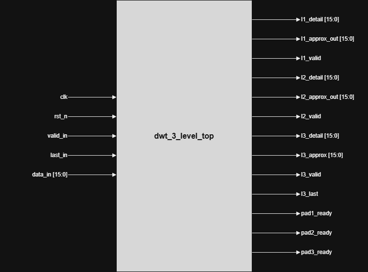
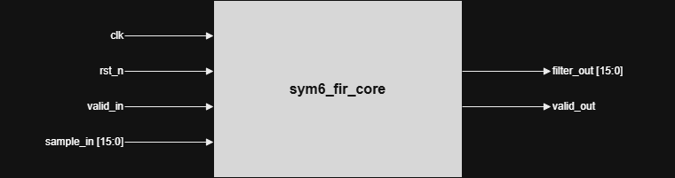
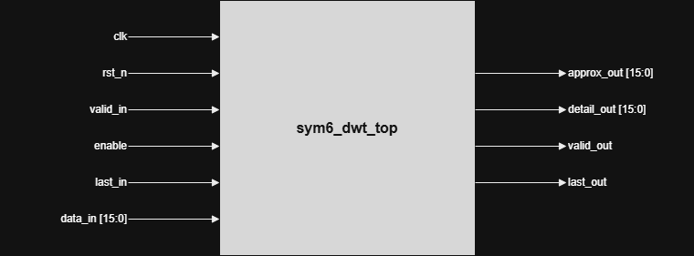
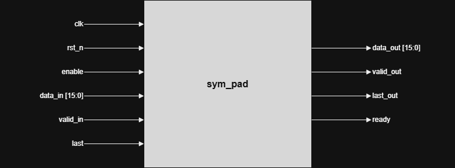
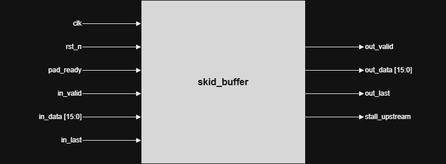

# ECG 3-Level DWT (sym6, Mallat Filter Bank)

## PROJECT OVERVIEW

This project implements a **3-level Discrete Wavelet Transform (DWT)** in SystemVerilog, built for ECG-like signals. It uses the **sym6 wavelet** and the **Mallat filter bank method**: the signal is broken down using FIR filtering followed by downsampling, repeated three times.

Each level of the transform produces two outputs:
- **Approximation** - the smooth, low-frequency part of the signal
- **Detail** - the sharp, high-frequency part

The approximation from one level becomes the input to the next level.

The project also includes a testbench that drives a sample ECG waveform into the design, and a Python script that checks the hardware output against a trusted software reference.

---

## ARCHITECTURE OVERVIEW

The pipeline is composed of five building blocks:

| Module | Role |
|---|---|
| `sym_pad` | Symmetric edge padding for each level |
| `sym6_fir_core` | FIR MAC filter, reused for both low-pass and high-pass paths |
| `sym6_dwt_top` | One full decomposition level (pad → dual FIR → downsample) |
| `skid_buffer` | One-sample elastic buffer protecting the handshake between levels |
| `dwt_3_level_top` | Top-level module wiring all three levels together |

### Signal Flow

```
data_in → [sym_pad] → [sym6_dwt_top] (Level 1) → [skid_buffer] →
          [sym_pad] → [sym6_dwt_top] (Level 2) → [skid_buffer] →
          [sym_pad] → [sym6_dwt_top] (Level 3)
```

Each `sym6_dwt_top` internally instantiates two `sym6_fir_core` modules running in parallel: one low-pass, one high-pass.

---

## TOP-LEVEL DIAGRAM



**Ports:**

| Direction | Signal |
|---|---|
| Inputs | `clk`, `rst_n`, `valid_in`, `last_in`, `data_in [15:0]` |
| Outputs | `l1_detail [15:0]`, `l1_approx_out [15:0]`, `l1_valid`, `l2_detail [15:0]`, `l2_approx_out [15:0]`, `l2_valid`, `l3_detail [15:0]`, `l3_approx [15:0]`, `l3_valid`, `l3_last`, `pad1_ready`, `pad2_ready`, `pad3_ready` |

It connects three pairs of `sym_pad` and `sym6_dwt_top`, one pair per level. A `skid_buffer` sits between level 1 and level 2, and another sits between level 2 and level 3, protecting the handshake at each boundary. Level 3 has no further stage after it, so it does not need a skid buffer.

---

## MODULE-BY-MODULE EXPLANATION

### `sym6_fir_core`



| Direction | Signal |
|---|---|
| Inputs | `clk`, `rst_n`, `valid_in`, `sample_in [15:0]` |
| Outputs | `filter_out [15:0]`, `valid_out` |

**Function:** This is the FIR filter module, used for both the low-pass and high-pass filters at every level.

- Each new input sample is pushed into a **12-element history register**; the oldest sample is dropped and every other sample shifts back one position.
- The filtering itself is a **multiply-accumulate (MAC)**: each of the 12 samples is multiplied by its matching coefficient, and all 12 products are summed to produce the filtered output.
- The filter needs to see **11 samples** to fill the history register before it produces a valid output; a counter tracks this and holds `valid_out` low until the window is full.
- The final sum is rescaled with a rounding step and a right shift, since the coefficients are stored as fixed-point fractions, keeping the output in the same 16-bit range as the input.

---

### `sym6_dwt_top`



| Direction | Signal |
|---|---|
| Inputs | `clk`, `rst_n`, `valid_in`, `enable`, `last_in`, `data_in [15:0]` |
| Outputs | `approx_out [15:0]`, `detail_out [15:0]`, `valid_out`, `last_out` |

**Function:** One full level of the wavelet transform, using two copies of `sym6_fir_core` in parallel on the same input, one with low-pass coefficients and one with high-pass coefficients.

- The low-pass copy produces the **approximation** signal; the high-pass copy produces the **detail** signal.
- Both filters produce a new output every input sample, but only every second one is kept - the **downsample-by-2** step, driven by a toggling flag.
- **Last-sample protection:** the module tracks whether the current output is the final sample of the stream and, if so, forces it through as valid regardless of the downsample flag, guaranteeing the last sample is never silently dropped.

---

### `sym_pad`



| Direction | Signal |
|---|---|
| Inputs | `clk`, `rst_n`, `enable`, `data_in [15:0]`, `valid_in`, `last` |
| Outputs | `data_out [15:0]`, `valid_out`, `last_out`, `ready` |

**Function:** Handles the edges of the signal. FIR filters need samples before and after the real data to produce correct output near the boundaries; without this, the first and last few outputs of each level would be wrong.

- Mirrors samples at the start and end of the stream (standard **symmetric padding**).
- Sequence of states: fills an internal buffer with the first several samples → replays them backward, then forward again, creating the mirrored lead-in → passes real incoming samples straight through → on the last sample, replays the most recent samples backward once more, creating the mirrored tail → resets and is ready for the next stream.

---

### `skid_buffer`



| Direction | Signal |
|---|---|
| Inputs | `clk`, `rst_n`, `pad_ready`, `in_valid`, `in_data [15:0]`, `in_last` |
| Outputs | `out_valid`, `out_data [15:0]`, `out_last`, `stall_upstream` |

**Function:** Solves a specific timing problem between two consecutive pipeline levels.

- Each level's valid output is registered, reflecting a decision made one clock cycle earlier. A level can produce a valid output on the exact cycle the next stage stops accepting data - if dropped there, that sample is gone for good.
- The skid buffer is a **one-sample holding register**: if a sample arrives while the next stage can't accept it, it's caught and held, then presented as the next valid output as soon as downstream is ready - ahead of any new data.
- While holding a sample, it signals upstream to pause (`stall_upstream`), since it can only hold one sample at a time. This guarantees no sample is ever lost, even under back-to-back stalls.

---

### `dwt_3_level_top`

See the block diagram in [Top-Level Diagram](#top-level-diagram) above.

**Function:** The top-level module that wires everything above together into the full 3-level pipeline.

- Connects three pairs of `sym_pad` and `sym6_dwt_top`, one pair per level.
- A `skid_buffer` sits between level 1 and level 2, and another between level 2 and level 3, protecting the handshake at each boundary.
- Level 3 has no further stage after it, so it does not need a skid buffer.
- Exposes the detail and approximation outputs for all three levels, along with their valid flags, so the rest of the system or the testbench can read them directly.

---

## VERIFICATION

### Testbench

The testbench drives a fixed **200-sample ECG-like waveform** into the top-level module, one sample per clock cycle, waiting whenever the design signals it is not ready to accept new data.

As the design produces outputs, the testbench prints every level 1, level 2, and level 3 result as it appears, along with its detail and approximation values. This printed output feeds into the Python verification step.

### Python Verification Script

This script checks the hardware's output against a trusted reference:

1. Regenerates the exact same ECG-like waveform used by the testbench.
2. Runs that waveform through a well-established software wavelet library to compute the same 3-level sym6 decomposition as a reference.
3. Parses the printed hardware output to extract detail and approximation values at each level.
4. **Reconstruction check:** runs the hardware's output through the inverse wavelet transform to reconstruct the original ECG signal. A close match (within ~1 unit, from normal fixed-point rounding) confirms filtering, downsampling, padding, and timing are all correct; a large difference points to a real problem in the pipeline.
5. Saves a plot comparing the original and reconstructed signals, along with all three levels of detail and approximation.

---

## CONCLUSION

The presented 3-level sym6 DWT architecture:
- Uses a **Mallat filter-bank** (FIR + downsample) approach, reusing a single MAC-based FIR core for both low-pass and high-pass paths
- Guarantees **no sample loss** at stream boundaries via last-sample forcing in `sym6_dwt_top` and elastic buffering via `skid_buffer`
- Is verified **end-to-end** against a software wavelet reference, including full signal reconstruction
